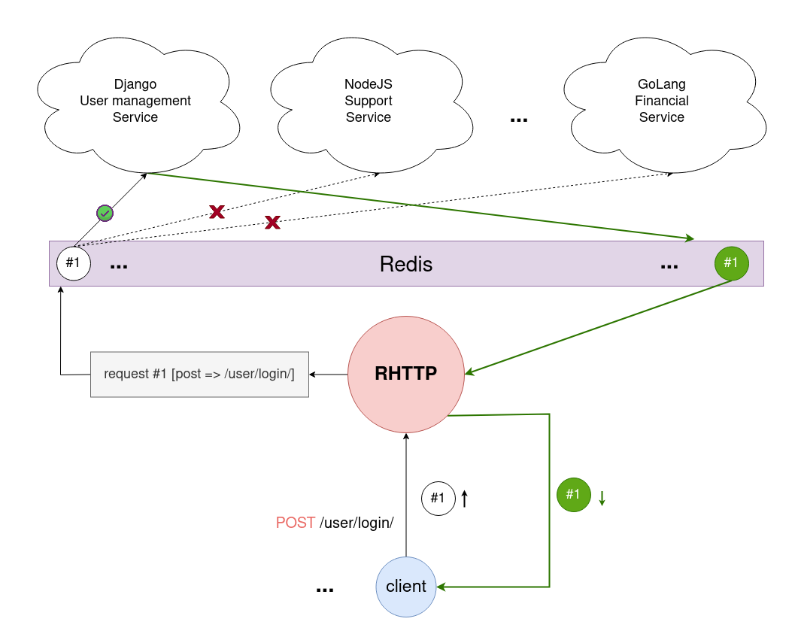
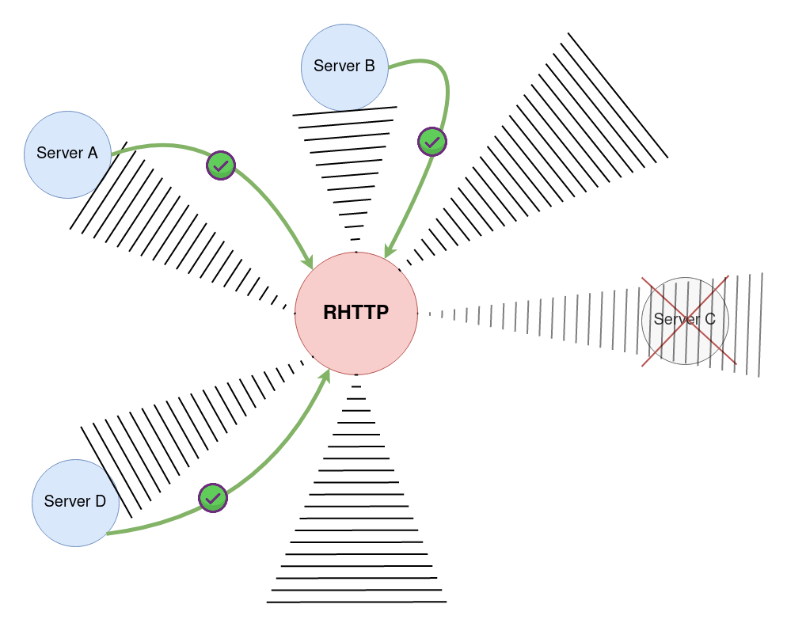

# RHTTP

>Redis HTTP server for hybrid back-end services

This server can provide a microservice backend in the shortest time and with the highest efficiency.

**RHTTP** (Redis HTTP) Takes HTTP requests and publishes them into Redis. Then other servers can receive requests and make corresponding response for them, Then publishes response into Redis again and RHTTP server sends response to user.

Services can seamlessly join/leave to RHTTP network without any interruption. RHTTP uses some mechanism I named it "Bat Vision" to detect new services or detect some service that left the network. RHTTP can send request to new services immediately after joining them and receive repsonses from them without any overhead.    

## Requirements
* [CArgs](https://github.com/pedramcode/cargs)
* [HIRedis](https://github.com/redis/hiredis)
* [Libevent](https://libevent.org/)
* LibSSL
* SQLite3

## License
This project is licensed under the terms of the MIT License. See the [LICENSE](LICENSE.txt) file for details.