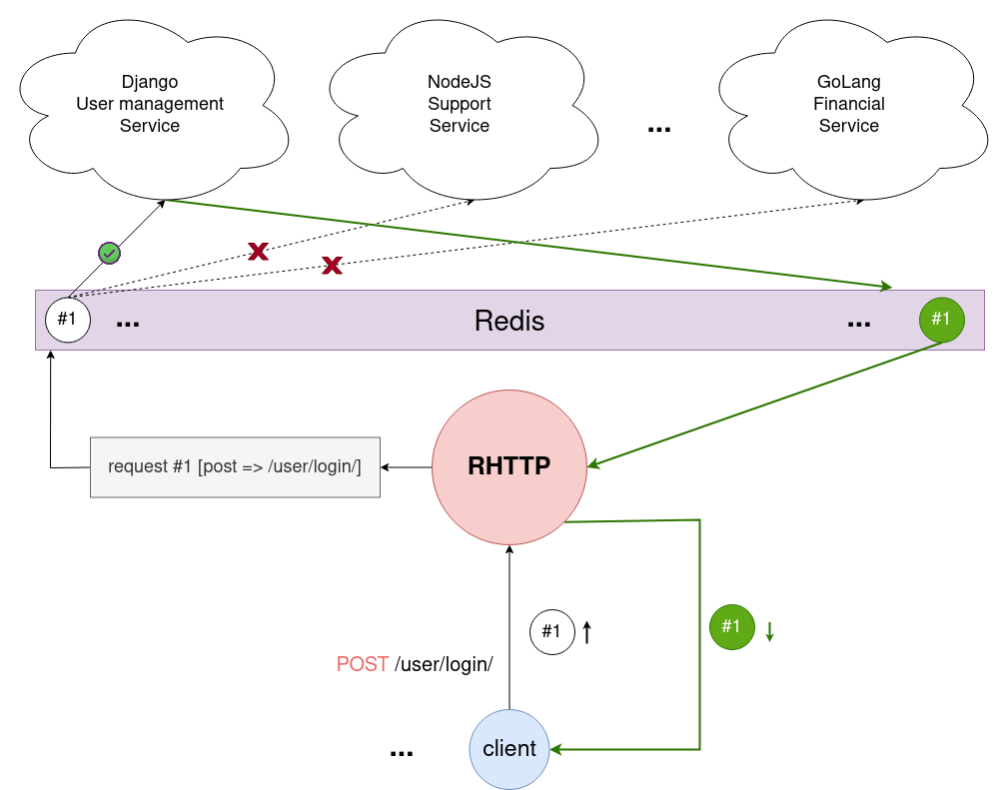

# RHTTP

>Redis HTTP server for hybrid back-end services

This server can provide a microservice backend in the shortest time and with the highest efficiency.

**RHTTP** (Redis HTTP) Takes HTTP requests and publishes them into Redis. Then other servers can receive requests and make corresponding response for them, Then publishes response into Redis again and RHTTP server sends response to user.

## Requirements
* [CArgs](https://github.com/pedramcode/cargs)
* [HIRedis](https://github.com/redis/hiredis)
* [Libevent](https://libevent.org/)
* LibSSL
* SQLite3

## License
This project is licensed under the terms of the MIT License. See the [LICENSE](LICENSE.txt) file for details.